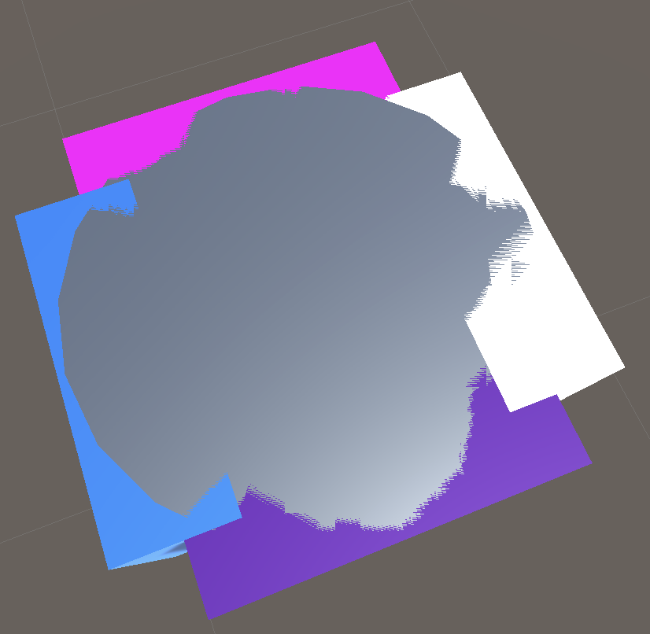
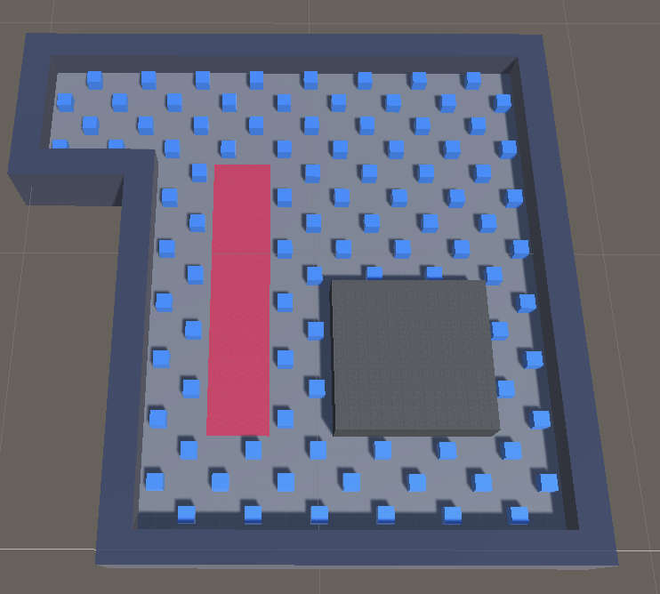
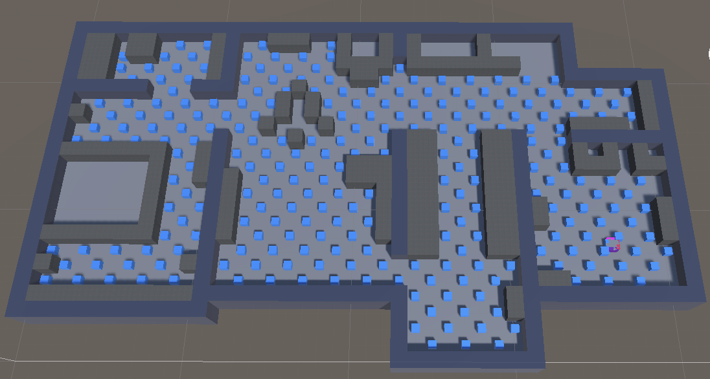
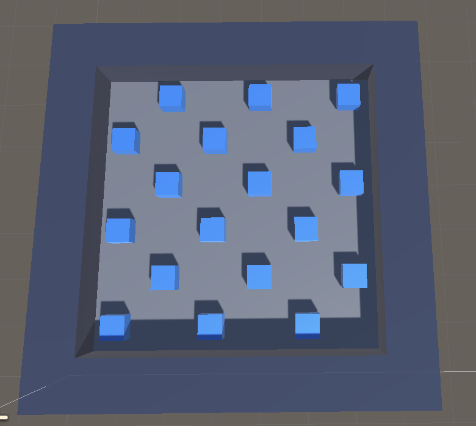
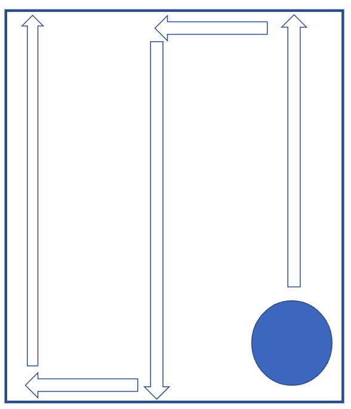
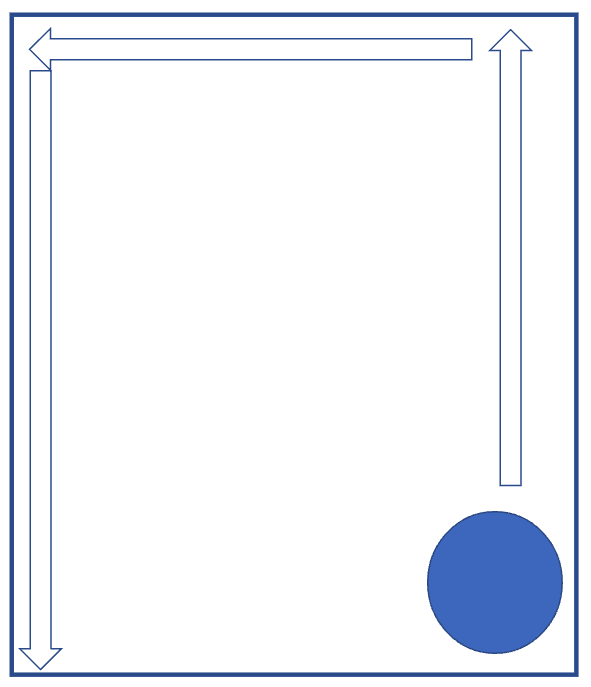
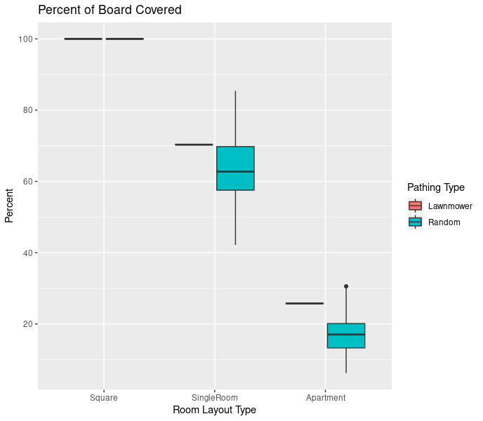
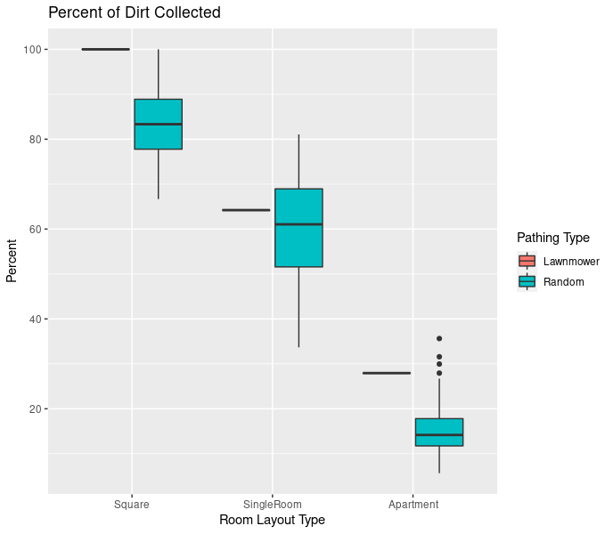
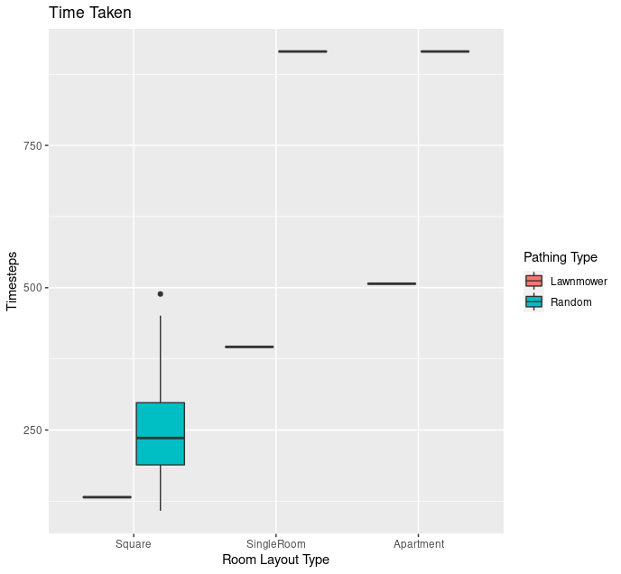
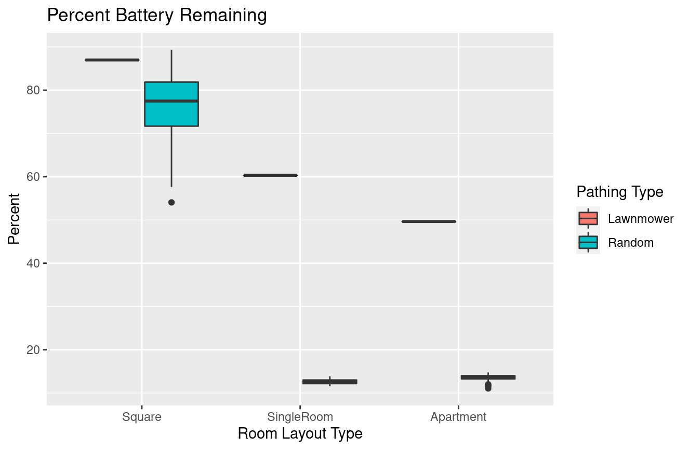

# Exploring the Effectiveness of a Robot Vacuum (Roomba)

## Details of the Simulation
Over the last year I created a simulation of a robot vacuum moving through an area. 

This roomba has 4 colliders- one along each edge

### The Rooms
I started my exploration using the Single Room, and spent most of the year testing my pathing algorithms within that space.

This room has 187 potential tiles to visit including 95 dirt particles. 

Knowing that the Single Room was not the most accurate representation of the kinds of spaces the Roomba would need to traverse, I created a larger, more realistic space by recreating the first floor of my apartment. Being the most realistic, it's also the most complex, with many small pockets where the Roomba can get stuck. 

This room has 562 potential tiles to visit including 247 dirt particles. 

After working with these spaces I was frustrated that the Roomba was performing poorly using the algorithms I'd created. It took a while to realize that these algorithms were never going to work- and that was okay- there's a reason these are the approaches to pathing utilized in the cheaper models. 

I, however, wanted a scenario where the algorithms could succeed. I then added the Square, which is just a 8 x 8 grid without any obstacles. 

This room has 64 potential tiles to visit including 18 dirt particles. 

### Pathing 
I implemented two different approaches to moving the Roomba through the space: the 'Lawnmower' (coined by Dr. Erik Fredericks) and Random. Both approaches move the Roomba forward in a given direction until it collides with an obstacle, the difference is in how the algorithm responds to this collision.

#### Lawnmower

When the Roomba collides with an obstacle, it turns and begins traveling down the next column.

#### Random

When the Roomba collides with an obstacle,it picks a new direction at random in which it will travel.

## Data Gathering

## Results

